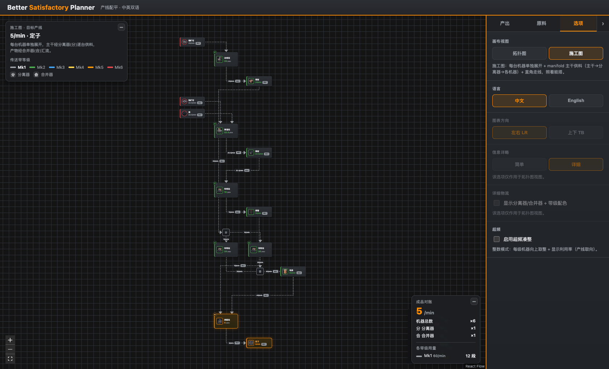
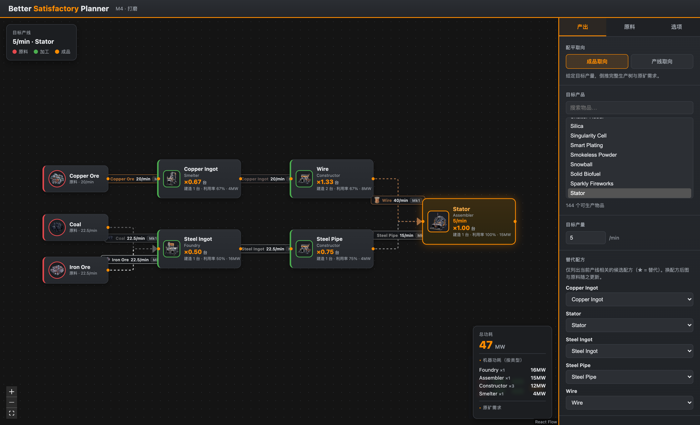
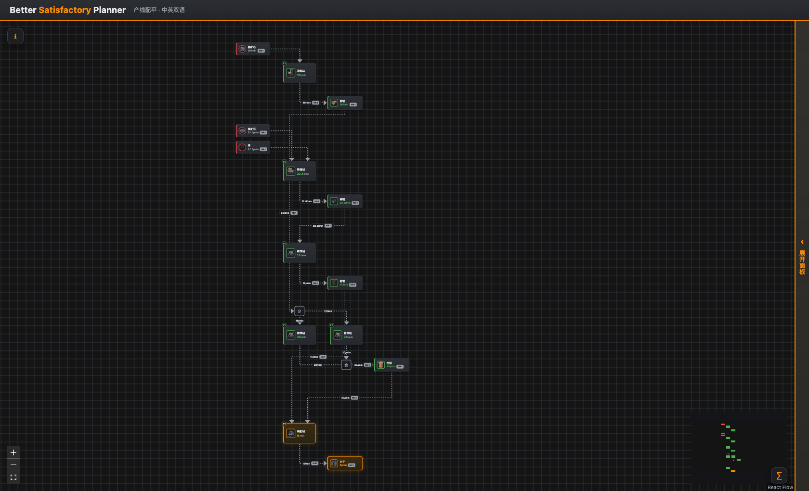

# Better Satisfactory Planner

> 《幸福工厂 / Satisfactory》生产线配平计算器 —— **双向配平** + **施工图级走线**，为新手而生。

对标 [satisfactory-calculator](https://satisfactory-calculator.com/)，但补上了它最欠缺的东西：不仅告诉你「要多少台机器」，还画出**照着就能搭**的施工图（哪台机器、走几级传送带、分离器/合并器接到哪）。

纯前端单页应用，游戏数据打包进包内，**完全离线可用**。



---

## ✨ 核心特性

### 双向配平
- **成品取向（反向）** —— 给目标成品/min，倒推完整生产树 + 原矿需求 + 总功耗。对标传统计算器。
- **产线取向（正向）** —— 给固定原矿输入（60/120/240/自定义），算出**整数台机器** + 实际产量 + 瓶颈高亮。这才是新手实际搭厂的思路。

### 两种视图（可切换）
- **拓扑图** —— 抽象「组对组」，机器折叠 `xN`，贝塞尔曲线，一眼看全局配平。
- **施工图** —— 对标 B 站 UP 主的手绘施工图：机器阵列展开成 N 台独立机器，**manifold 歧管供料**走线，分离器/合并器精确到每台机器，直角连线模拟地基对齐。

### 施工图的细节
- **传送带分级配色** —— Mk1~Mk6 冷→暖色 + 图例，一眼看出哪段要升级高级带、哪段省钱。
- **分离器(分)/合并器(合)** —— manifold 主干供料：N 台机器 = N-1 个分离器串联抽料 / N-1 个合并器汇流，标注每段流量。
- **多入口 offset** —— 装配站（2 入口）、制造器（4 入口）等，不同物料的传送带各自接到**错开的独立入口**，不合流到一个点，跟游戏物理接口一致。
- **物流汇总** —— 分/合总数、各带级用量、成品对账速率。

### 交互
- **图片网格选品** —— 目标产品用带图标的弹窗网格选（分类 + 搜索），不用对着一堆英文下拉猜。
- **替代配方智能筛选** —— 只列**当前产线相关**的候选配方（★ 标注替代），不糊脸列游戏几百个。
- **超频** —— 产线取向可开超频（1.0~2.5x）把多台凑成更少的超频机器；关则严格整数台数 + 利用率。
- **中英双语** —— i18next，默认中文，一键切 English，物品/机器/配方名全覆盖。
- **可折叠面板** —— 左上信息 / 右下对账 / 右侧配置面板都能收起，腾出画布 ≥80%。

| 拓扑图视图 | 施工图（面板折叠） |
| --- | --- |
|  |  |

---

## 🚀 快速开始

```bash
npm install      # 安装依赖
npm run dev      # 本地预览 → http://localhost:5173
npm test         # 单测 (vitest, 47 项)
npm run build    # 类型检查 + 生产构建
```

纯静态，`npm run build` 产物可直接部署到任意静态托管（GitHub Pages / Vercel / Nginx / …）。

---

## 🗂 数据层（`data/`）

游戏数据来自官方 SCIM 数据，**全 JSON 驱动，零硬编码配方**。游戏更新时更新流程很干净：

```bash
# 1. 重新下载官方数据（satisfactory-calculator 的 gameData）到 data/scim-en-stable.json
# 2. 重新归一化
python3 data/normalize.py            # → data/data.normalized.json
python3 data/build_zh_names.py       # → src/i18n/names.zh.json（中文名映射）
```

| 文件 | 说明 |
| --- | --- |
| `data/scim-en-stable.json` | 官方游戏数据 (SCIM en-Stable, ~1.5MB) |
| `data/normalize.py` | 归一化脚本 |
| `data/data.normalized.json` | 归一化输出：**178 物品 / 551 建筑 / 306 可自动化配方（110 替代）** + `producers` 反向索引 |
| `public/icons/` | 180 个本地图标（绕过 SCIM CDN 防盗链，离线可用） |

### schema (`data.normalized.json`)
```
items{id, name, category, color, image, isRaw}
buildings{id, name, power, image, beltSpeed, extractionRate, input?, output?}
        # input/output = 物理进/出料口数（Assembler 2/1、Manufacturer 4/1）
recipes{id, name, machines[], duration(秒), ingredients{item:qty/周期}, produce{item:qty/周期}, isAlternate}
producers{itemId: [recipeId...]}   # 反向索引：物品→能生产它的配方（替代配方筛选用）
```

### 关键公式
- 单机产能/min = `produce_qty × 60 / duration × clock`（clock 1.0~2.5）
- 超频功耗/MW = `基础功耗 × clock ^ 1.321321`
- 带速档位：Mk1=60 · Mk2=120 · Mk3=270 · Mk4=480 · Mk5=780 · Mk6=1200 /min

---

## 🛠 技术栈

Vite + React + TypeScript + [@xyflow/react](https://reactflow.dev/)（流程图）+ [@dagrejs/dagre](https://github.com/dagrejs/dagre)（拓扑布局）+ Zustand（状态）+ i18next（双语）。深色主题 + Satisfactory 橙。

## 🏗 架构

**算法层（`src/lib/`）纯函数、无 UI 依赖**，渲染层只做透传/派生，两者严格分离。

| 模块 | 职责 |
| --- | --- |
| `lib/types.ts` | `GameData` / `Item` / `Building` / `Recipe` 类型 |
| `lib/data.ts` | 加载归一化数据 + `getItem/getRecipe/getBuilding/isRawItem` |
| `lib/rates.ts` | `machineCapacity` / `outputPerMin` / `overclockPower` / `BELTS` / `suggestBelt` |
| `lib/recipes.ts` | `chooseRecipe`（默认 base，可 override）/ `getRelevantRecipes` |
| `lib/trace.ts` | `traceProduction` 自顶向下展开生产树（正反向共用，含循环保护） |
| `lib/forward.ts` | `balanceForward` 正向配平（产线取向） |
| `lib/reverse.ts` | `balanceReverse` 反向配平（成品取向） |
| `lib/logistics.ts` | `computeLogistics` 物流估算（分离器/合并器 + 带级） |
| `lib/blueprint.ts` | `computeBlueprint` 施工图计算（机器阵列 + manifold 级联） |
| `store/plannerStore.ts` | Zustand 全局状态 + 派生 hook（输入变→实时重算重渲染） |
| `components/FlowGraph` | 拓扑图渲染 |
| `components/Blueprint*` | 施工图渲染（自定义节点/直角边/HUD） |
| `components/panel/` | 产出/原料/选项三 Tab + 图片选品 + 替代配方下拉 |
| `i18n/` | i18next 资源 + 物品/机器/配方名查表（三级优雅回退） |

图层适配器（`components/buildFlow.ts`）把正/反向两种算法结果归一化成同一个 `GraphResult`，
于是同一套渲染既能画反向也能画正向，算法层完全不感知 UI。

### 快速上手 API

```ts
import { balanceReverse, balanceForward, getRelevantRecipes } from './lib';

// 成品取向：5 定子/min → 倒推
const r = balanceReverse('Desc_Stator_C', 5);
r.totalPower;   // 47 (MW)，与游戏一致
r.rawTotals;    // { Desc_OreIron_C:22.5, Desc_Coal_C:22.5, Desc_OreCopper_C:20 }

// 产线取向：钢管 15/min + 线材 40/min → 恰好 5 定子/min，1 台 Assembler 100%
balanceForward('Desc_Stator_C', { Desc_SteelPipe_C: 15, Desc_Wire_C: 40 });

// 替代配方智能筛选：只列当前产线相关的候选配方
getRelevantRecipes('Desc_Stator_C');  // { items, recipes, byItem }
```

### 测试
`vitest`，覆盖配平/物流/施工图算法 + i18n 查表。`npm test` **47/47 全绿**。

---

## 📋 项目状态

Multica 项目「Better Satisfactory Planner」全部里程碑 + 改进已完成：

- [x] 数据层（官方数据归一化 + 反向索引 + 物理口数）
- [x] 双向配平算法 + 单测
- [x] 流程图渲染（React Flow）
- [x] 交互三 Tab + 替代配方智能筛选 + 超频
- [x] 打磨（边图标/带速建议/瓶颈高亮/功耗分组/tooltip）
- [x] 图片网格选品 · i18next 中英双语
- [x] 施工图视图（机器阵列 + manifold 走线 + 传送带分级）
- [x] 装配站多入口 offset 走线 + 面板可折叠
- [ ] 部署（可选，待定 GitHub Pages / 自托管）

---

## 致谢

游戏数据来自 [Satisfactory Calculator (SCIM)](https://satisfactory-calculator.com/)。
《Satisfactory》© Coffee Stain Studios。本工具为社区非官方作品。
